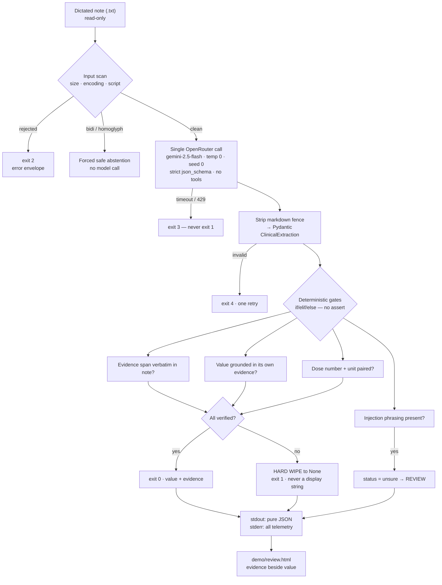

# MediExtract

**One dictated consult note in, four verified clinical fields out — each with the quote it came
from, and blank wherever the system cannot prove it.**

NTU PE6201 End-of-Course Project. `google/gemini-2.5-flash` via OpenRouter, one call per note, no
framework: the whole pipeline is a single auditable file, [`src/extract.py`](src/extract.py).

> Dr. Aisha is a general practitioner in a Singapore polyclinic. She will not accept an
> AI-generated dose she cannot verify in **under 3 seconds**. That constraint, not accuracy in the
> abstract, is what the design optimises: every field is shown beside the verbatim span it was
> taken from, and a field that cannot be grounded is shown blank rather than guessed.

The persona and problem decomposition behind that are in [`docs/decomposition.md`](docs/decomposition.md).

---

## Quick start

```bash
python3 -m venv .venv && source .venv/bin/activate && pip install -r requirements.txt
./.venv/bin/python -m unittest discover -s tests          # 377 tests, no API key needed
./.venv/bin/python src/extract.py --note gold/case_001.txt --mock
```

No key is required for the test suite, the offline CLI, the scoring tools or the demo screen.
Full manual, including live runs and costs: **[`commands.md`](commands.md)**.

## Architecture



Four fields — `medication`, `dose`, `frequency`, `allergy` — each carrying `value`, `evidence`
and `status`. The gates are the product: **a wiped field is a success, not a failure.**

## Results

Against sealed `gold-v2`, 67 Eka Care consults, 268 field decisions.

| Arm | Pooled recall | vs. |
| :--- | ---: | :--- |
| **gemini-2.5-flash, gated** | **0.7297** | — |
| regex + RxNorm gazetteer (14,689 names) | 0.381 | the non-AI comparator |
| majority class ("everything is not_stated") | 0.000 | agrees with gold on 113/268 anyway |

Cost **$0.000617 per note** → **~$3.58 per physician-year** at 24 notes/day (`docs/cost_to_serve.md` records $3.57 from the previous run at $0.000615/note; the 0.3% gap is run-to-run token variation, not a revision). Median latency
1,293 ms; 66/67 inside the 3-second budget.

Three findings the evaluation produced that the headline does not show:

- **Structural dependency.** Strip ALL-CAPS section headers and allergy recall falls
  0.900 → 0.650 (McNemar p = 0.0625, the exact floor at n = 20). Every gate in the system is a
  *precision* control; none is a recall control. [`guardrails.md` §6.6]
- **Near-distribution robustness.** Re-dictate the same consults around byte-identical labels and
  recall is 0.730 → 0.750, 9 flips right / 6 wrong, p = 0.6072 — a null. Together with the line
  above: the crutch is the header specifically, not prose formatting. [§6.9]
- **The LLM judge was built and refused.** S-14's adoption gate was written before the code:
  0.9 agreement on *both* classes. Measured 0.9467 / **0.2093**, and it does not beat a
  rubber stamp (0.8284 against 0.8396). Not adopted. [§6.8]

A corrected answer key raises a score without the extractor changing, so the gold-v2 move is
reported in three parts: 0.6452 (gold-v1) → 0.7230 (same outputs, corrected labels, **p = 0.008**)
→ 0.7297 (live). **7.8 points are the labels; 0.7 is sampling noise that does not separate.**

## Dataset integrity

Every corpus is hash-sealed and mode `0444`. A seal is write-once; corrections go to a new version.

| Version | SHA-256 | n | What it is |
| :--- | :--- | ---: | :--- |
| `gold-v1` | `1f594e46…` | 67 | 268 hand-labelled fields, Eka Care Latin-script split. **Never edited.** |
| `gold-v2` | **`d5e90f5a…a959`** | 67 | gold-v1 + 18 corrections: 16 rule-derived, 2 signed by `rohit` |
| `allergy-v1` | `10725be9…` | 20 | MTSamples notes with positive allergies (gold-v1 has zero) |
| `allergy-v1-stripped` | `1d02348e…` | 20 | the same labels, ALL-CAPS headers removed — the leakage report |
| `paraphrase-v1` | `fa3fa8bf…` | 67 | the same consults re-dictated around identical values — the near-distribution arm |

```bash
cd data/gold_labels && shasum -a 256 -c *.sha256      # all five OK
```

## Reproducing

```bash
./.venv/bin/python -m unittest discover -s tests          # 377 tests
./.venv/bin/python -O -m unittest discover -s tests       # again, assertions stripped
./.venv/bin/python -m unittest tests.test_guardrails_doc  # the spec checks itself
./.venv/bin/python -m pyflakes src evals evals/probes tests demo data/gazetteer data/allergy_set
```

`python -O` is not ceremony. It strips `assert`, which is why no runtime gate may be one
(`CLAUDE.md` §2.2), and an AST walk enforces that across `src/`, `evals/` and `demo/`.
`tests/test_guardrails_doc.py` re-reads `guardrails.md` and fails if a quoted metric no longer
equals the artefact it names, if a cited `file:symbol` stops resolving, or if a snippet gains an
`assert`.

## Repository map

| Path | What |
| :--- | :--- |
| [`src/extract.py`](src/extract.py) | the entire pipeline — config, schema, prompt, gates, ledger, CLI |
| [`evals/run_ekacare.py`](evals/run_ekacare.py) | batch harness + the sealed-gold registry |
| [`evals/scoring.py`](evals/scoring.py) · [`evals/metrics.py`](evals/metrics.py) | pre-registered scoring · paired statistics, κ/AC₁, cost provenance |
| [`evals/spend_guard.py`](evals/spend_guard.py) | can *refuse* a call — deliberately not the module that scores one |
| [`evals/paraphrase.py`](evals/paraphrase.py) · [`evals/judge_calibration.py`](evals/judge_calibration.py) | near-distribution arm · LLM-judge calibration |
| [`guardrails.md`](guardrails.md) | security specification, OWASP LLM Top 10 **2026**, self-verifying |
| [`docs/forensic_audit.md`](docs/forensic_audit.md) | independent data-lineage audit of this repository |
| [`docs/cost_to_serve.md`](docs/cost_to_serve.md) · [`docs/technique_selection.md`](docs/technique_selection.md) | unit economics · why a foundation model and not rules/RAG/agents |
| [`commands.md`](commands.md) | every command, verified |

## Scope and limits

Not an agentic system: one call, no tools, no memory, no retrieval, no write-back. That is why
OWASP's **LLM** Top 10 (2026) applies and the Agentic Top 10 does not — `guardrails.md` §2 carries
the crosswalk and the threshold at which each agentic control would activate.

The evaluation is 67 consults. Wilson intervals are reported on every rate, a paired test on every
delta, and a large p-value is reported as *the evaluation is too small to tell* rather than as
equivalence. Labels are the author's, not a clinician's.

---

## Git release checklist

Nothing below is run automatically; this is the author's step.

```bash
# 1. the gate must be green first
./.venv/bin/python -m unittest discover -s tests && \
./.venv/bin/python -O -m unittest discover -s tests && \
./.venv/bin/python -m pyflakes src evals evals/probes tests demo data/gazetteer data/allergy_set && \
(cd data/gold_labels && shasum -a 256 -c *.sha256)

# 2. confirm no key or .env is staged
git status --short && git diff --cached --name-only | grep -E '^\.env|api[_-]?key' && echo "STOP"

# 3. commit
git add -A && git commit

# 4. tag the sealed corpora. gold-v1 and gold-v2 are already tagged (annotated);
#    paraphrase-v1 cannot be tagged until step 3 puts its file in a commit.
git tag -l                                     # expect: gold-v1, gold-v2
git tag -a paraphrase-v1 -m "paraphrase-v1 sealed fa3fa8bf...5642b — near-distribution arm"

# 5. push commits AND tags — `git push` alone pushes NEITHER tag.
#    gold-v1 is currently tagged locally only, which is why --tags matters here.
git push origin main
git push origin --tags

# 6. verify on the remote, and verify the tag really holds the sealed bytes
git ls-remote --tags origin                    # expect gold-v1, gold-v2, paraphrase-v1
git show gold-v2:data/gold_labels/gold_v2.json | shasum -a 256   # d5e90f5a...a959
```

| Check | Why |
| :--- | :--- |
| `gold-v1` tag unchanged | `CLAUDE.md` §1.3: immutable, no history rewrites, no force-push |
| `gold-v1` tag reaches the remote | it is annotated locally but **absent from `origin`**, so the immutability §1.3 claims is currently unenforced for anyone else |
| `paraphrase-v1` tagged | a tag names a commit, so its file must be committed first |
| `guardrails.md` pushed with the artefacts it cites | `tests/test_guardrails_doc.py` fails on the remote otherwise |
| `.env` absent from the diff | it is gitignored; check anyway |
| all five `.sha256` files pushed | the seals are unverifiable without them |
