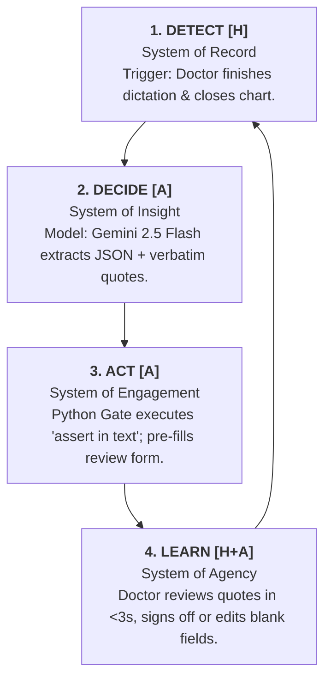

# MediExtract

## Whiteboard Decomposition: MediExtract
**PE6202 · Week 7 · The Art of Decomposition**

---

### 01. THE DISRUPTION (Broken Experience)

**👤 Persona:** Dr. Aisha (Attending Family Physician, Singapore Polyclinic)

**💬 Customer Quote:**
> "I dictated the whole consult, but now I still have to manually retype medication, dose, and frequency into separate EHR boxes just to close the chart."

**Pain Points & Quantified Impact:**
* 157 minutes/day spent on clerical documentation (44.2% of an 11.4h workday) + 86m pyjama time.
* Existing scribes generate raw prose well, but fail to prove WHERE a field value came from.
* Dr. Aisha will not accept an AI-generated dose unless she can verify it in under 3 seconds.

---

### 02. FUTURE-STATE LOOP (Detect → Decide → Act → Learn)

*To visualize this loop in markdown, here is the cycle breakdown:*

1. **DETECT [H]**
   * **System:** System of Record
   * **Action:** Trigger: Doctor finishes dictation & closes chart.
2. **DECIDE [A]**
   * **System:** System of Insight
   * **Action:** Model: Gemini 2.5 Flash extracts JSON + verbatim quotes.
3. **ACT [A]**
   * **System:** System of Engagement
   * **Action:** Python Gate executes `assert in text`; pre-fills review form.
4. **LEARN [H+A]**
   * **System:** System of Agency
   * **Action:** Doctor reviews quotes in <3s, signs off or edits blank fields.

*(Note: The cycle repeats, looping from Learn back to Detect for the next chart).*

---

### 03. OUTCOME MATRIX

| Task / Outcome | Human Handoff (H) | Autonomous Agent (A) | AI / Automation Value |
| :--- | :--- | :--- | :--- |
| **Entity Extraction** <br>*(Med/Dose/Freq/Allergy)* | Reads full text manually to locate drug details | Single-pass LLM schema extraction via OpenRouter | Eliminates manual reading and text-scanning overhead |
| **Grounding & Evidence Verification** | Line-by-line manual cross-checking | Python Gate executes `assert evidence in text` | Shifts verification time from minutes to <3 seconds |
| **Form Pre-filling & Abstention** | Manually retypes into discrete EHR boxes | Pre-fills form fields or blanks ungrounded fields | Deterministic safety gate; prevents dangerous wrong doses |
| **Final EHR Sign-off & Submission** | Reviews pre-filled form, confirms, and signs off | Formats validated JSON for final EHR database commit | Strict safety boundary: Human remains in total control |

---

### 04. DATA MAP

| Loop Step | Source System & Layer | Exists Today? | Context Quality / Gate |
| :--- | :--- | :--- | :--- |
| **Detect** *(Trigger)* | EHR System (Record) | ✅ YES | Raw dictated consult text |
| **Decide** *(Extraction)* | Gemini 2.5 Flash API (Insight) | ✅ YES | Schema-constrained structured JSON |
| **Act** *(Grounding Gate)* | Python Evidence Gate (Context) | ⭕ **NO (CIRCLED)** <br> `[TO BE BUILT]` | `assert evidence in source_text` <br> *(Case/whitespace normalized check)* |
| **Learn** *(Sign-Off)* | EHR Database / Audit Log (Record / Agency) | ✅ YES | Verified schema fields saved; corrections logged for eval |



Four critical fields out of a dictated clinical note, with a verbatim
evidence span for each, so a polyclinic physician can verify the whole
extraction in under three seconds.

Status: single-note pipeline and batch evaluation loop built and tested offline.
Inference goes through OpenRouter (`google/gemini-2.5-flash`) via the OpenAI SDK.

## Run it

```bash
python3 -m venv .venv && ./.venv/bin/pip install -r requirements.txt
# put OPENROUTER_API_KEY=<your key> in .env at the repo root (never commit it)

./.venv/bin/python src/extract.py --note gold/case_001.txt
```

Every request carries: a 15 s timeout and one retry (set on the SDK, whose
defaults are 2 retries and a 600 s read timeout); a 1,024-token output cap;
reasoning off; a strict JSON schema; and OpenRouter routing that only uses
providers honouring every parameter (`require_parameters`) and not collecting
prompts (`data_collection: deny`). For public or synthetic notes only,
`--provider-data-collection allow` widens routing.

No key, no credit, still exercises the safety gates (the canned response
contains deliberate fabrications):

```bash
./.venv/bin/python src/extract.py --note gold/case_001.txt --mock
```

`stdout` is only ever one JSON document: the extraction (`"status": "ok"`)
or an error envelope (`"status": "error"`, with a `code`). While the
pipeline runs, stdout is redirected to stderr, so a stray `print` from any
library cannot corrupt the JSON a downstream parser reads. A field wiped by a
gate is `null` in the extraction (a hard wipe); why it was wiped is a
`code` in the separate `gate` list. stdout never carries human-readable text:
the review screen maps a code to its label (for example
`BLANK (Abstained: Ungrounded)`) with `extract.DISPLAY`, and gate reasons,
error messages and evaluation tables go to stderr. An error envelope is
`{"status": "error", "code": ..., "data": null, ...}`, with the message on stderr.

A note carrying hidden or look-alike characters (bidirectional controls,
zero-width or other invisible characters, homoglyphs such as a Cyrillic `е`
inside `metformin`) is a **forced safe abstention**: every field is wiped with
`ABSTAIN_ENCODING_ANOMALY`, the model is not called, and the dictation is
never "cleaned" to rescue an extraction. Measured: 0 of the 156 Eka notes
trigger it; µg, Ménière, β-blocker, mg/m² and similar notation do not.

Flags that matter later:

| flag | why |
| --- | --- |
| `--no-gate` | report gate verdicts but wipe nothing — the abstention test |
| `--budget-usd N` | total spend ceiling across runs (default $8.00, or `MEDIEXTRACT_BUDGET_USD`); checked before every call; the ledger records OpenRouter's reported cost |
| `--provider-data-collection allow` | public or synthetic notes only; default is `deny` |
| `--json-only` | suppress the stderr table |

### Exit codes

Every outcome has its own code, so the Week 3 harness can count abstentions
off the exit code without mistaking a crash for one.

| code | meaning | stdout |
| --- | --- | --- |
| 0 | every field verified, not stated, or routed to review | extraction |
| 1 | at least one field wiped by a gate | extraction |
| 2 | input rejected: missing, unreadable, empty, over 20,000 characters, binary, not UTF-8 | envelope `ERR_INPUT_*` |
| 3 | upstream failure: timeout, unreachable, rate limited, auth, model unavailable (404), no eligible provider | envelope `ERR_UPSTREAM_*`, `ERR_RATE_LIMITED`, `ERR_MODEL_UNAVAILABLE`, `ERR_NO_ELIGIBLE_PROVIDER` |
| 4 | model output failed the schema on both attempts, or was truncated at the token cap | envelope `ERR_SCHEMA_INVALID`, `ERR_OUTPUT_TRUNCATED` |
| 5 | spend ceiling reached (the call was not made), or OpenRouter credit exhausted (402) | envelope `ERR_BUDGET_EXCEEDED`, `ERR_UPSTREAM_CREDITS_EXHAUSTED` |
| 6 | configuration or internal error | envelope `ERR_CONFIG_*`, `ERR_INTERNAL` |

argparse usage errors also exit 2, but print no envelope.

### Batch evaluation (`evals/run_ekacare.py`)

```bash
./.venv/bin/python evals/run_ekacare.py                          # live: sealed gold-v1 + OPENROUTER_API_KEY
./.venv/bin/python evals/run_ekacare.py --gold-version gold-v2   # once gold-v2 is sealed
./.venv/bin/python evals/run_ekacare.py --experiment my-change --run-cap-usd 0.25
./.venv/bin/python evals/run_ekacare.py --mock --gold data/gold_labels/gold_v1_template.json --limit 3
```

One model call per case (cached under `data/cache/runs/<run_id>/`, so
`--run-id <same id>` resumes without paying twice); the same output is gated
and ungated, so the abstention test costs no extra call; scores come from
`evals/scoring.py`. Results land in `evals/results/<run_id>/` (manifest,
gated and ungated JSONL, `scores.json`, `rows.csv` with formula-safe cells);
stdout is one JSON summary.

**Which gold set.** `--gold-version` selects a registered, sealed set; each entry
(`run_ekacare.py:REGISTRY`) declares its path, its SHA-256 file, the corpus it may score and
the label schema the file must itself declare.

| version | cases | what it is for |
| :--- | ---: | :--- |
| `gold-v1` (default) | 67 | the headline. 268 hand labels, Eka Care, sealed |
| `gold-v2` | 67 | gold-v1 with 18 corrections and slice tags, sealed `d5e90f5a…`. **Report it beside gold-v1, never instead of it** — see below |
| `allergy-v1` | 20 | MTSamples notes with a positive allergy under an ALL-CAPS header. The project's only allergy positives |
| `allergy-v1-stripped` | 20 | the same notes and the **same labels** with every header removed — the leakage report, paired against `allergy-v1` |

A live run refuses, before any call: any gold file other than the sealed file of the requested
version; a file whose SHA-256 no longer matches its seal; a file from another corpus or
declaring another schema version; unlabelled fields; note text that drifted from its md5; a
prompt changed since the seal (unless `--experiment NAME`, reported separately); and a worst
case the remaining budget cannot cover. A circuit
breaker halts the run after 3 consecutive system failures, above a 5% error
rate after 20 calls, or at once on a spend refusal (batch exit codes: 0 done,
2 refused, 3 halted, 5 spend, 6 internal). Tag a case `#negation`,
`#attribution` or `#temporality` in its labelling note to put it in a slice.

### The non-AI baseline (`evals/baseline.py`, `evals/score_arm.py`)

```bash
./.venv/bin/python data/gazetteer/fetch_rxnorm.py            # once, needs network
./.venv/bin/python evals/baseline.py --split report          # regex only, held-out 47
./.venv/bin/python evals/score_arm.py evals/results/baseline-pattern-report --split report
```

The comparator `project_proposal.md` §4 commits to: regex and an optional gazetteer, no model,
no network, no spend. It writes a run-shaped directory, so `score_arm.py`, `diagnose.py` and
`demo/build_review.py` all read it unchanged, and every field goes through the same
`apply_gates` the model's output does — the comparison is between extractors, not scorers.
Patterns are tuned on a seeded 20-case subsample and `--split report` scores the other 47, so a
tuned extractor is never reported on the cases it was tuned on. `score_arm.py` scores any arm
in that shape (baseline, a low-code console run pasted back, a second annotator) and always
prints the majority-class baseline beside it. Measured results are in
`docs/technique_selection.md`.

### The physician's verification screen (`demo/build_review.py`)

```bash
./.venv/bin/python demo/build_review.py                      # newest run -> demo/review.html
```

One static HTML file from a finished run: the dictation with each quote highlighted, the fields
beside it, and blanks shown as blanks. No JavaScript, no form, no network, and
`Content-Security-Policy: default-src 'none'` — a screen that renders clinical text is an
output-handling surface (control S-07, OWASP LLM10:2026), and these notes contain literal
`<PII>` placeholders that naive interpolation would swallow. `demo/notes/` holds the crafted
notes the recorded demonstration uses; they live outside `gold/` so that directory stays clean.

### Cost and token accounting (`evals/spend_guard.py`)

Every live call is audited: prompt, completion, cached and reasoning tokens, the list-price
estimate against OpenRouter's own charge, latency, attempts, and where it went — endpoint,
provider, model requested versus model served, response id. Per-call lines land in
`data/cache/metrics/<run_id>.jsonl` (gitignored, they carry response ids); an aggregate
`metrics.json` is written beside the run's other artefacts, and the running total appears on
each progress line.

Two bounds, not one. The `$8` project ceiling belongs to `extract.SpendLedger`; each run also
carries `--run-cap-usd` (default `$1.00`), checked against *worst case* before every call,
because a loop inside one run would stay under the project ceiling while consuming it. A breach
is refused before the call, carries `ERR_BUDGET_EXCEEDED` and exits 5 — never the generic halt
code. Exactly one component records each call to the ledger: `extract.call_model` for the
pipeline, or `CostGuard(records_to_ledger=True)` for a script that calls the endpoint directly.

Measured over 67 live calls, the list-price model matched the provider's charge to $0.000001 in
total, which is what makes the ceiling trustworthy rather than notional.

### Schema probes (`evals/probes/`)

```bash
./.venv/bin/python evals/probes/probe_v4_schema.py --dry-run   # schemas only, no spend
./.venv/bin/python evals/probes/probe_v4_schema.py             # live, capped at $0.002
```

`probe_v4_schema.py` asks the endpoint a question that cannot be answered offline: does strict
structured output still work when the schema is an array of objects with `maxItems`? It tries
the strict v4 list, then the same list without the wire-level bound, then today's v3 schema as
a control, and stops at the first accepted variant. **Result (2026-09-20): `v4-strict`
accepted on the first attempt** — `maxItems: 12`, nested objects, `additionalProperties: false`,
`require_parameters: true`, `temperature: 0`, `seed: 0`, one call, $0.000635.

### Is the difference real? (`evals/metrics.py`)

```bash
./.venv/bin/python evals/metrics.py evals/results/<run_id>              # describe one run
./.venv/bin/python evals/metrics.py evals/results/<run_a> <run_b>       # compare two
```

Pure functions over artefacts already on disk: no network, no key, nothing written. It reports
the three **populations** (scored, error envelope, refused by our own encoding gate — only the
first says anything about the model), **layer ownership** for every failing field (schema,
labels, prompt, gate or model), **cost per correct field** rather than per call, and the question
neither of the other tools answers: *how far apart must two of these numbers sit before the gap
means anything?* Two runs over the same gold set are paired, so only fields that changed carry
information and the test is an exact McNemar.

It is built so it cannot contradict `scores.json`: per-field precision and recall use
`scoring.py`'s definitions, the confidence interval is `scoring.wilson`, and causes come from
`diagnose.attribute`. A test asserts the match against every finished run on disk, because two
implementations of one metric are two answers to one question.

### Why a run scored what it did (`evals/diagnose.py`)

```bash
./.venv/bin/python evals/diagnose.py                       # the newest run
./.venv/bin/python evals/diagnose.py evals/results/<run_id> > diagnosis.json
```

Read-only, no model calls: it re-reads a finished run's cached payloads and
sorts every field decision into one cause, so a single recall number can be
split into a model that named the wrong fact, a model that named the right
fact in the wrong format, and a label that contradicts its own field rule.
The first of its five arms reproduces `scoring.py`'s pre-registered recall and
silent-failure rate exactly (a test pins this); the other four each relax one
named convention and are diagnostics, never the headline. It also lists the
gold labels that `extract.verify_value` - the gate the pipeline applies to the
model - would reject, as candidates for a gold-v2 labelling pass.
`gold_v1.json` is never written to. stdout is one JSON document, the tables go
to stderr.

### Results so far

Every row is the same 67 sealed gold cases, the same gates, and the same pre-registered
matching rules in `evals/scoring.py`. Recall is the headline; the silent-failure rate — a field
shown as VERIFIED that is wrong — is the one to drive to zero.

| Arm | recall | precision | silent | abstain | medication | dose | frequency |
| :--- | ---: | ---: | ---: | ---: | ---: | ---: | ---: |
| model, prompt `a92d2abc` (current) | **0.645** | 0.694 | 0.308 | 0.027 | 0.696 | 0.565 | 0.660 |
| model, prompt `73c882d1` (first run) | 0.600 | 0.650 | 0.350 | 0.021 | 0.571 | 0.543 | 0.679 |

The two model rows are **not statistically separated** (paired McNemar p = 0.14); see below
before quoting the gap between them as an improvement.
| regex baseline, pattern-only | 0.381 | 0.527 | 0.473 | 0.000 | 0.321 | 0.196 | 0.604 |
| regex baseline, held-out 47 cases | 0.353 | 0.483 | 0.517 | 0.000 | 0.233 | 0.200 | 0.610 |
| regex + RxNorm gazetteer (14,689 names) | 0.381 | 0.488 | 0.512 | 0.000 | 0.339 | 0.196 | 0.585 |
| majority class ("everything is not_stated") | 0.000 | — | — | — | — | — | — |

The majority-class row is why the others need context: answering `not_stated` to everything
already agrees with gold on **113 of 268** field decisions (42.2%) while finding nothing.

**What the prompt fix bought, and what cannot yet be claimed.** `a92d2abc` corrected a
contradiction in `FIELD_RULES` — one rule offered `Dolo 650` as a medication name while the other
claimed the `650` as the dose — and told the model that `not_stated` means the empty string, not
the word. Two different kinds of evidence came back, and they deserve different confidence:

- **The mechanism is established.** The failure category "same drug, strength appended to the
  name" went from **8 occurrences to zero** (`evals/diagnose.py`). That is a count of a named
  defect, not a noisy rate.
- **The recall improvement is not.** Paired over the same 155 labelled fields, 12 fields flipped
  wrong → right and 5 flipped right → wrong: exact McNemar **p = 0.14**, so the 4.5-point pooled
  gain is *not separated* at α 0.05. Medication alone is 9 flips against 2, **p = 0.065** —
  suggestive, still not separated. Run `evals/metrics.py <run_a> <run_b>` to reproduce.

A large p-value here does not mean the two prompts are equally good; it means 155 fields is too
small a sample to tell, which is a fact about this evaluation rather than about the prompts. The
remedy is more labelled fields, which is one more argument for gold-v2. Cost $0.041221 for 67
calls.

**Where the rest of the gap is.** Not the model. Two of 65 failures in the first run were the
model failing to read something; the remainder is a single medication slot in a corpus whose
notes carry a median of three drugs, plus 16 gold labels that contradict a rule the gold set
itself states. Conditioned on the 51 notes where the labeller and the model named the same
drug, dose was right 24 of 26 and frequency 30 of 30. Full attribution in
`docs/technique_selection.md`; the cost consequence in `docs/cost_to_serve.md`.

**Allergy, and the header leakage.** gold-v1 has zero allergy positives, so the field was
unmeasured until `allergy-v1`. On its 20 positives, allergy recall is **0.900 with the ALL-CAPS
`ALLERGIES:` header and 0.650 without it** — 5 fields changed and every one got worse, so a
quarter of that performance was reading the header rather than the sentence. Pooled 0.622 →
0.489. The exact paired p is 0.063, which is the *floor* for five one-directional flips
(2/2⁵), so the design is underpowered at n = 20 rather than the finding being weak; six flips
would clear 0.05. Reproduce with
`evals/metrics.py evals/results/leak-allergy-v1 evals/results/leak-allergy-v1-stripped
--gold data/gold_labels/allergy_v1.json`.

This set's medication numbers are **not** comparable with gold-v1's: it uses "the first
medication in the MEDICATIONS section", and the notes are American surgical reports rather than
Singapore dictation.

**A corrected answer key is not an improved system.** gold-v2 fixed 18 labels that broke rules the
gold set itself states, so the score rises without the extractor changing. The three numbers that
have to travel together:

| Scored | Recall | What it is |
| :--- | ---: | :--- |
| gold-v1 run vs gold-v1 | 0.645 | the historical headline |
| **the same saved outputs** vs gold-v2 | **0.723** | the label correction alone — no model call |
| a fresh live run vs gold-v2 | 0.730 | label correction plus one more sampling |

Of the 8.5-point move, **7.8 points are the labels** (8 flips, all one way, paired McNemar
p = 0.008) and **0.7 is sampling noise** that does not separate (p = 1.000). Every label flip is in
frequency, where the corrections were. The unpaired Fisher test on the same data gives p = 0.373 —
it would have called the clearest signal in the project noise, which is why `metrics.py` reports
both and labels which one applies.

**What actually breaks when a header goes.** Of the five header-dependent allergy flips, **four are
the model going silent** (`found → not_stated`), not getting it wrong. And **67 of 67** Eka Care
notes have no ALL-CAPS header at all, so Singapore dictation is already the stripped condition:
the header-assisted 0.900 is the number that does *not* transfer. Three of the seven failures are
our own "first substance listed" labelling rule, which marks `Sulfa and trimethoprim` wrong for
being more complete than the label.

**Operational.** API latency p50 1,213 ms, p95 1,600 ms across the current run, with one outlier
at 11,993 ms — so 66 of 67 finished inside the 3,000 ms verification budget, not 67. (The first
run's maximum was 2,442 ms and all 67 were inside it.) `within_budget` now means API time plus
local time; measuring only the local clock reported that 12-second call as inside the budget.

### Tests

```bash
./.venv/bin/python -m unittest discover -s tests
./.venv/bin/python -O -m unittest discover -s tests       # the deployment gate
./.venv/bin/python -m unittest tests.test_guardrails_doc  # guardrails.md checks itself
```

`tests/test_guardrails_doc.py` is why the specification can be trusted at 2,400 lines: every
`file:symbol` it cites must resolve, every snippet must parse and contain no `assert`, a snippet
copied from shipped code must still match it semantically (docstrings excluded, logic and names
not), no snippet may import a forbidden dependency, and every figure §0 quotes must equal the
artefact it names. Each check was verified by deliberately breaking it.

Offline, no API key, no spend: the live-call paths run against a fake
client, or fail by design before any client exists. The suite also fails if
an `assert` statement appears under `src/` — `python -O` strips them, so a
gate written as one would silently stop running.

## Build the gold set (do this before any model sees the notes)

### The dataset

`ekacare/clinical_note_generation_dataset` at revision `662c58a`, measured
2026-09-16:

| | |
| --- | --- |
| rows | 156, one config (`default`), one split (`test`) |
| declared language | `language:en` on the dataset card |
| **measured script** | **67 Latin, 88 Devanagari (~44 Hindi, ~44 Marathi), 1 Telugu** |
| romanised code-mixed | 5 rows flagged (Hinglish written in Latin script) |
| format | unlabelled run-on speech or dictation; no speaker tags |
| reference labels | inside each row's `rubrics` text as `Category ID:` lines |
| access | gated; licence accepted per Hugging Face account |

**The card's `language:en` does not hold row by row.** Most rows are Hindi or
Marathi in Devanagari script, often with English medical terms transliterated
("हेवी हेडेड फील"). An English-only analysis needs a filter:
`--script latin` restricts the pool to the 67 Latin-script rows before
sampling. `provenance.language` and `provenance.filter` record what was
measured and which filter was applied.

What the reference labels say about the four fields:

| rows with a reference label | all 156 | Latin 67 |
| --- | --- | --- |
| medication | 56% | 81% |
| dose (the rubric means quantity, e.g. "1 tablet") | 26% | 40% |
| frequency | 53% | 79% |
| allergy (drug or food) | 4% | **3% - 2 rows** |
| medications per row with any (median / max) | 3 / 12 | 3 / 12 |

Two consequences for the evaluation:

- **Allergy recall can't be measured on this dataset.** Only 2 Latin-script
  rows carry an allergy label at all. Measure allergy on MTSamples instead.
- **Notes carry several medications**, but the extraction schema holds one. The
  labelling guide and the extraction prompt must use the same rule for which
  one counts.

### Access

You need both of these:

1. accept the terms on the dataset page while signed in
2. a token that can read gated repos you do not own. Either a classic **Read**
   token, or a fine-grained token with *Read access to contents of all public
   gated repos you can access* ticked. A fine-grained token scoped only to your
   own namespace gets a 404, and the tool says so.

Put the token in `.env` as `HF_TOKEN=<token>`; the tool reads it directly.
Don't `export HF_TOKEN=hf_...` with the literal placeholder: a shell variable
overrides `.env` for the rest of that session. The tool refuses placeholders
and tells you to `unset HF_TOKEN`.

### Steps

```bash
./.venv/bin/python evals/label_gold_v1.py profile              # writes nothing
./.venv/bin/python evals/label_gold_v1.py template             # = --script latin --n all
./.venv/bin/python evals/label_gold_v1.py label --labeller <name>
./.venv/bin/python evals/label_gold_v1.py stats
./.venv/bin/python evals/label_gold_v1.py validate --seal
git add data/gold_labels/gold_v1.json data/gold_labels/gold_v1.sha256
git tag -a gold-v1 -m "frozen gold labels, 67 hand-labelled Eka Care cases, 4 critical fields"
```

`profile` takes the same arguments as `template` and writes nothing. Use it to
look before committing to a draw.

**The gold set is all 67 Latin-script rows** (decided 2026-09-16, after
profiling), so nothing is sampled and nothing can drift: 268 labels over notes
with a median length of 58 words. Three of those rows (0, 2, 3) were partly
read during format inspection before the decision; `provenance.exposure`
records that.

**Field definitions** live once, in `FIELD_RULES` in `src/extract.py`. The
Gemini system prompt and the labelling session both render that same text, and
the template stores a copy in `provenance.field_rules`. Decisions baked in:
`medication` is the single most clinically significant one; `dose` is the
*strength* as dictated (a quantity like "1 tablet" is not a dose); `dose` and
`frequency` always describe that same medication. Type `?` at a status prompt
to see a rule again, and use the case note to say why you picked the
medication you did.

**Sampling, if you ever want a subset.** `template` pulls all 156 rows and profiles them. It then applies
`--script` and draws a seeded random sample of N from what remains, without
replacement (`--seed 42` by default; `--head` takes the first N instead). The printed table puts the full split, the
head 30 and the seeded 30 side by side: length, word count, speaker turns, and
the share of rows carrying each reference label, and the script mix. Any draw
that drifts from its pool past a threshold is named, line by line.

The seed, the selected `row_idx`, the Python version, the population and
sample profiles, and any drift flags all go into `provenance`. **Choose the
seed before looking, and don't re-roll it to make the numbers look nicer.** A
seed picked after looking is a selected sample. If the draw drifts, report it.

The reference figures come from the dataset's own rubric categories. The
regex-proxy rows are a weaker, English-only fallback: a dictated
"paracetamol 500" has no unit, so they undercount. Neither is ground truth -
labelling is.

**Labelling.** `label` refuses any evidence span that is not a verbatim
substring of the note, using the *same* `verify_evidence` the pipeline runs at
inference time. When the rejection is just retyped whitespace or casing, it
offers the real span from the source. When there is no similar span at all, it
says so, because that usually means you are on the wrong case.

**Sealing.** `validate` blocks the tag on unlabelled fields, on non-verbatim
spans, and when `source_text` has drifted from the md5 recorded at pull time.
`--seal` refuses any file that didn't come from the real dataset, so a
fixture can never land at `data/gold_labels/gold_v1.json`. Sealing is
**write-once**: it refuses if `gold_v1.json` exists (there is no overwrite
flag), records the prompt fingerprint and model, writes `gold_v1.sha256`, and
makes both files read-only. A wrong label is fixed in a new file sealed as
gold-v2, never by editing gold-v1.

The rows API serves only the default branch, so on that path the pinned
revision is recorded but not enforced (`revision_enforced: false`). The
per-case md5 is what pins the text. `--via datasets` enforces the revision
but needs `pip install datasets`.

## What is here

```
src/extract.py     the whole pipeline, one file (CLAUDE.md 1.1), in sections:
                   1 configuration, 2 schema (wire + gold), 3 prompt, 4 deterministic
                   gates, 5 spend ledger, 6-7 pipeline and CLI
tests/             offline unittest suite: gates, budget, CLI contract, scoring, batch loop, seal
evals/             label_gold_v1.py (profile / template / label / validate / stats),
                   label_gold_v2.py (declared corrections to the sealed gold-v1),
                   label_allergy_v1.py (the allergy set + its headers-stripped twin),
                   run_ekacare.py (batch loop + the sealed-gold registry),
                   scoring.py (metrics, Wilson CIs), diagnose.py (failure
                   attribution), baseline.py (the non-AI comparator),
                   score_arm.py (score any arm in run shape), spend_guard.py
                   (per-call cost audit and the per-run cap: ENFORCEMENT),
                   metrics.py (populations, layers, separability: MEASUREMENT),
                   probes/ (live schema spikes)
demo/              build_review.py -> review.html (the verification screen), notes/
docs/              cost_to_serve.md, technique_selection.md, video_script.md,
                   the Colab first-version notebook
data/gazetteer/    fetch_rxnorm.py + the fetched ingredient list, with provenance
gold/              synthetic dictations for smoke tests. Real labels: data/gold_labels/.
```

## Design notes worth defending in the report

**Evidence is emitted before value.** With thinking disabled the token order
is the reasoning order, so the model must copy a span out of the dictation
before it may commit to a value. Asking for the value first invites it to
decide the answer and then hunt for justification.

**Nothing in the field schema is optional.** A Pydantic default drops the key
from `required` in the generated Gemini schema, which would let the model
silently omit `evidence` — the one field the design rests on.

**Near misses are logged, not forgiven.** A span that matches only after
whitespace/case normalisation is still blanked, but flagged `near_miss`. That
separates paraphrasing from fabrication, so Week 2 can decide whether to relax
the gate to normalised matching from counts rather than from vibes.

## Two types for a field, on purpose

`ExtractedField` is a wire schema: nothing optional, absence is the empty
string, because that is what Gemini's schema subset handles cleanly and because
a missing key there fails silently.

`GoldField` is a human artefact, where `status: null` means *no human has
looked at this yet* - which has to stay distinguishable from *a human looked and
the note does not state it*. Collapse those two and generating the template
hands you 120 free `not_stated` labels, every one of which scores as a correct
abstention. `GoldField.to_extracted_field()` is the only bridge, so scoring
compares like with like.

## Gates beyond the verbatim check

`evidence in source_text` proves the span is real. It does not prove the
`value` derived from it is right, so a second gate (`verify_value` in
`src/extract.py`) checks the value against the verified span:

- **dose** — every number and unit must match the span. `50 mg` against a
  span of `15 mg` is blanked, as are `mcg` against `mg` and a unit the
  physician never dictated.
- **frequency** — the value must be a phrase of the span, or a recognised
  equivalent of one (`bd` → `twice daily`).
- **medication, allergy** — every word of the value must appear in the span.

Known limit, pinned by a test: a value that is a verbatim sub-phrase of its
span still passes (`daily` out of `twice daily`). The physician sees the quote
beside it. The full control inventory is in `guardrails.md`.

## Not yet verified

No live call has been made from `src/`: there is no OpenRouter key in this
environment. Verified offline instead: the request (SDK timeout, retries,
token cap, strict schema, routing, data policy, no tools), every error
mapping, retries, truncation, fenced JSON, the ledger, the stdout guard, the
batch loop's refusals, resume, breaker and scoring (98 tests, also under
`python -O`). `google/gemini-2.5-flash` is listed by OpenRouter's public models
API (checked 2026-09-18, $0.30 / $2.50 per million tokens) - the 404 the Colab
prototype hit came from Google's direct API. The first live smoke test should
be one synthetic note (`src/extract.py --note gold/case_001.txt`); if routing
returns `ERR_NO_ELIGIBLE_PROVIDER`, the data policy found no provider, which
is a decision to take deliberately, not a flag to flip for patient data.
